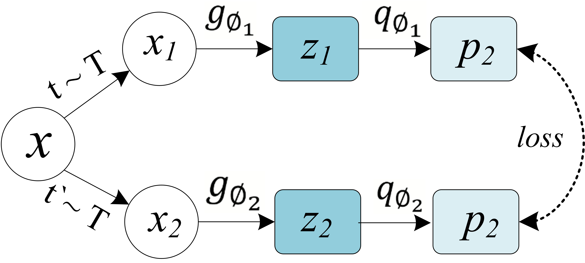

# Margin Regularization to Improve SAR Crop-Classification using-Self-Supervised-Learning

PyTorch implementation and pretrained models for our approach SimSiam with Margin Regularization. For details, see (put link)

## Description

This paper presents a self-supervised approach that uses the redundancy reduction principle to create a model with better generalization properties and robustness for crop classification as the downstream task, especially beneficial for imbalanced datasets, such as those usually observed in crop classification. Specifically, we combine the unsupervised pretext task of self-supervised methods with a notion of margin that enables efficient mapping of hard samples in the latent space, ultimately improving the crop classification downstream task. We report a consistent improvement in the classification accuracy compared to a baseline self-supervised method without margin, narrowing the gap between the SSL method and the fully supervised one.

## Training

### Dataset

Campo Verde (CV), Mato Grosso state. Luis Eduardo Magalhães (LEM), Bahia state. 
<p align="center">
  
</p>

### Dependencies

Please install PyTorch and download the Campo Verde dataset. This codebase has been developed with python version 3.6, PyTorch version 1.7.1, CUDA 11.0 and torchvision 0.8.2. The exact arguments to reproduce the models presented in our paper can be found in the cl_cv_config file. For training please run:
```
python cl_cv.py
```

### Method


